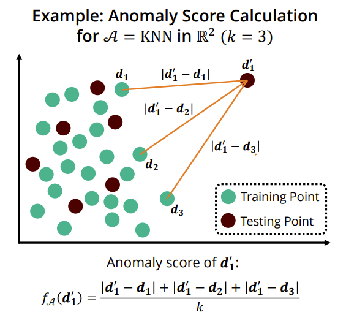
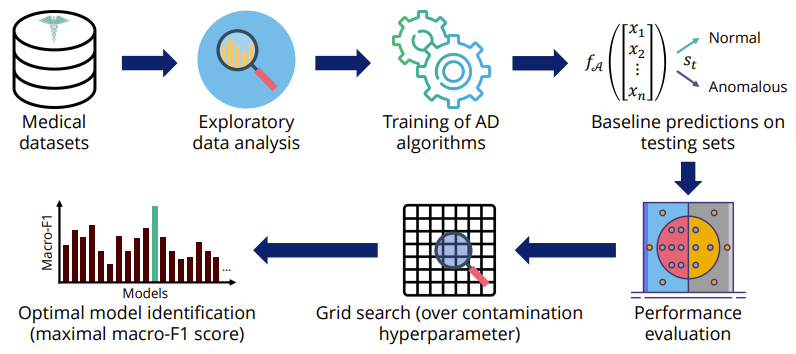

# Unsupervised Medical Anomaly Detection Using TODS

This repository represents novel research on unsupervised medical anomaly
detection using [TODS](https://github.com/datamllab/tods), an open-source
anomaly detection package developed by Rice University's DATA lab. The project
was made possible by Rice University's 2022 REU in Data Science, which was
sponsored by the National Science Foundation and the Rice University Department
of Computer Science.

**Authors:** Ryan Beckwith, Guanchu Wang, Allen Chuang, and Xia (Ben) Hu

## Background

Anomaly detection (AD) is the process of identifying patterns in data that do
not conform to the expected behavior. In this project, we aim to show that
unsupervised approaches for AD can be effective in medical contexts, where it
can be difficult to efficiently label data.

### Relevance of AD in Healthcare

- AD techniques are well-suited to challenges in disease detection (class
imbalance, labelling costs, poorly-defined anomaly classes).
- Many medical conditions can be thought of as anomalies.
- Medical anomalies can be highly diverse and often elude simple rule-based
detection approaches.
- Effective AD models can feasibly assist physicians in diagnosing patients.

### What is Unsupervised AD?

Given a training set $D$ of $m$ vectors in $\mathbb{R}^n$, a contamination
hyperparameter $c \in [0, 0.5)$, and a testing set $D'$ of $m'$ vectors in
$\mathbb{R}^n$, an unsupervised AD algorithm $\mathcal{A}(D \mid D', c)$ will
classify each vector $\mathbf{d_i'} \in D'$ as normal or anomalous as follows:

1. Let $f_\mathcal{A} \colon \mathbb{R}^n \to \mathbb{R}$ map an $n$-dimensional
vector $\mathbf{v}$ to its corresponding anomaly score, which is an
algorithm-specific scalar that quantifies "how anomalous" $\mathbf{v}$ is.

    For example, consider the following diagram, which shows how the $k$-Nearest
    Neighbors (KNN) algorithm defines its anomaly score function $f_A$:

    

2. Let $\mathbf{d_i} \in D$. Compute a vector of training anomaly scores,
$\mathbf{s} \in \mathbb{R}^m$, where the $i\text{th}$ component of $\mathbf{s}$
is equal to $f_\mathcal{A}(\mathbf{d_i})$.
3. Compute a vector $\mathbf{s_{max}}$ which contains the
${\lceil c \cdot m \rceil}$ highest anomaly scores in $\mathbf{s}$.
4. Define the threshold score, $s_t$, as the minimal anomaly score in
$\mathbf{s_{max}}$.
5. Using $s_t$, any $\mathbf{d_i'} \in D'$ such that
$f_\mathcal{A}(\mathbf{d_i'}) \geq s_t$ will be classified as anomalous, and any
$\mathbf{d_i'}$ such that $f_\mathcal{A}(\mathbf{d_i'}) < s_t$ will be
classified as normal.

### What is TODS?

Developed by Rice’s DATA lab, the
[Time-series Outlier Detection System (TODS)](https://github.com/datamllab/tods)
is a Python-based ML package for general-purpose AD, with a focus on time-series
data. For the purposes of this project, AD algorithms for tabular data were
utilized instead of time-series specific algorithms. The nine unsupervised AD
algorithms used in this project were implemented in TODS.

## Project Overview

In this project, we aim to show that unsupervised approaches for AD can be
effective in medical contexts, where it can be difficult to efficiently label
data. This is of paramount importance for medical problems where unsupervised
approaches must be utilized, and may serve as a practical alternative to
expensive deep-learning approaches for resource-strapped organizations.

### Project Goals

- To show that unsupervised AD algorithms can be effective in diverse healthcare
contexts.
- To show that TODS is a useful tool for medical AD.
- To demonstrate efficient alternatives to supervised approaches for medical AD.

### Analytical Methodology

## Medical Datasets

Three open-source medical datasets from diverse healthcare contexts were
selected for detailed analysis. All datasets are considered to be tabular in
nature, although the third dataset contains tabular data of time-series ECG
data. The datasets also vary greatly in terms of training/testing sizes and
contamination level (anomaly frequency). For more detailed information about
each dataset, please reference the documentation within the `medical_ad.ipynb`
file.

### [SPECTF Dataset](https://archive.ics.uci.edu/ml/datasets/SPECTF+Heart)

- **Summary:** Data on cardiac Single Proton Emission Computed Tomography (SPECT)
images.
- **Features:** 45 real-valued features (all integers ranging from 0-100).
- **Training size:** 80 instances (40 normal, 40 anomalous).
- **Testing size:** 30 instances (15 normal, 15 anomalous)
- **Labelled?** Yes (0 = normal, 1 = anomalous).

### [Cardiotocography (CTG) Dataset](https://archive.ics.uci.edu/ml/datasets/Cardiotocography)

- **Summary:** Measurements of fetal heart rate (FHR) and uterine contraction
(UC) features on cardiotocograms.
- **Features:** 21 summary statistics of cardiotocograms (# of fetal movements
per second, width of FHR histogram, etc.). Mix of real-valued (20) and
categorical attributes (1).
- **Training size:** 1,700 instances (1,329 normal, 371 anomalous)
- **Testing size:** 426 instances (326 normal, 100 anomalous)
- **Labelled?** Yes, 3-class (N=normal, S=suspect, and P=pathological)

### [MIT-BIH ECG Dataset](https://www.kaggle.com/datasets/shayanfazeli/heartbeat?resource=download&select=ptbdb_normal.csv)

- **Summary:** Consists of ECG heartbeat signals derived from the MIT-BIH
Arrhythmia Dataset.
- **Features:** 188 aligned time-series ECG voltage measurements (normalized
down to the range [0, 1] on a per-row basis), each taken at a sampling frequency
of 125 Hz.
- **Training size:** 87,554 (a subset of 10,000 points was actually used for
training, which contained 8,267 normal points and 1,733 anomalous points)
- **Testing size:** 21,892 (18,118 normal, 3,774 anomalous)
- **Labelled?** Yes (5-class labelling, ['N': 0, 'S': 1, 'V': 2, 'F': 3,
'Q': 4])

## Experimental Results

Nine unsupervised AD algorithms from TODS were identified as feasible candidates
for performing anomaly detection on the three previously mentioned datasets.
Several models with varying contamination hyperparameters were created for each
dataset/algorithm pairing, and model optimality was identified using the
macro-F1 evaluation metric.

The results from experimental tests are summarized in the below table, which
highlights the maximal macro-F1 scores obtained from testing each unsupervised
anomaly detection algorithm on each of the three medical datasets (after the
contamination grid search was performed). The table itself was created by
manually inspecting the outputs of the following experiments to identify
the top-performing configurations.

| Algorithm | SPECTF | CTG | MIT-BIH |
| --------- | :------: | :---: | :-------: |
| CBLOF | 0.83 | 0.67 | 0.61 |
| COF | 0.80 | 0.57 | 0.52 |
| HBOS | 0.80 | 0.58 | 0.63 |
| IForest | 0.80 | 0.65 | 0.64 |
| KNN | 0.80 | 0.62 | 0.60 |
| LODA | 0.80 | 0.70 | 0.67 |
| LOF | 0.83 | 0.61 | 0.55 |
| OCSVM | 0.33 | 0.23 | 0.67 |
| SOD | 0.73 | 0.54 | 0.56 |

### Why Macro-F1?

Unlike other single-number evaluation metrics (like accuracy, micro-F1, or
weighted-F1), the macro-F1 score better addresses the problem of
**class imbalance**, which is when there is an uneven distribution of label
classes in a given dataset. This is because the macro-F1 score evenly weighs all
per-class F1 scores (unlike the micro-F1 or weighted-F1 scores), thus giving
equal importance to each class, not each data point. As such, the macro-F1 score
is a favored metric in the anomaly detection space, where most (if not all)
datasets contain far more normal points than anomalous points. The general
formula for the macro-F1 score is given below:

$$ \textrm{F1}_{macro} = \frac{\textrm{F1}_{norm} + \textrm{F1}_{anom}}{2} $$

And as reminder, the general formulas for the F1 score, precision, and recall
(within the context of binary anomaly detection) are also given below:

$$ \textrm{F1} = \frac{2 \cdot \textrm{Precision} \cdot \textrm{Recall}}
                    {\textrm{Precision} + \textrm{Recall}}$$

$$ \textrm{Precision} = \frac{TP}{TP + FP} $$
$$ \textrm{Recall} = \frac{TP}{TP + FN} $$

Note that $FP$ represents the number of false positives identified by the AD
model, $FN$ represents the number of false negatives identified by the AD model,
and $TP$ represents the number of true positives identified by the AD model.
However, what exactly is meant by terms like "false negative" and "true
positive"? The answer depends on which class (normal or anomalous, in the case
of AD) you consider to be "positive" and which class you consider to be
"negative". As such, for the purposes of understanding the macro-F1 score, we
must understand what is meant by the term "per-class F1 score".

### Per-Class F1 Scores

In the context of AD, there are two per-class F1 scores that may be computed:
$\textrm{F1}_{norm},$ the F1 score obtained when the normal points are considered
to be the "positive" class, and $\textrm{F1}_{anom},$ the F1 score obtained when
the anomalous points are considered to be the "positive" class. Now that we have
defined these per-class F1 scores, we can investigate the formulas for each one
in depth. We begin with the formula for $\textrm{F1}_{norm},$ which is given as
follows:

$$ \textrm{F1}_{norm} = \frac{2 \cdot \textrm{Precision}_{norm} \cdot \textrm{Recall}_{norm}}{\textrm{Precision}_{norm} + \textrm{Recall}_{norm}} $$ 

where $\textrm{Precision}_{norm}$ is given by

$$ \textrm{Precision}_{norm} = \frac{TP_{norm}}{TP_{norm} + FP_{norm}} $$

where $TP_{norm}$ is given by

$$ TP_{norm} = \textrm{Number of truly normal points classified as normal by the AD model} $$

and $FP_{norm}$ is given by

$$ FP_{norm} = \textrm{Number of truly anomalous points classified as normal by the AD model} $$
and where $\textrm{Recall}_{norm}$ is given by

$$ \textrm{Recall}_{norm} = \frac{TP_{norm}}{TP_{norm} + FN_{norm}} $$

where $FN_{norm}$ is given by

$$ FN_{norm} = \textrm{Number of truly normal points classified as anomalous by the AD model} $$

Identically, the formula for $\textrm{F1}_{anom}$ can be given in a similar
manner:

$$ \textrm{F1}_{anom} = \frac{2 \cdot \textrm{Precision}_{anom} \cdot \textrm{Recall}_{anom}}{\textrm{Precision}_{anom} + \textrm{Recall}_{anom}} $$ 

where $\textrm{Precision}_{anom}$ is given by

$$ \textrm{Precision}_{anom} = \frac{TP_{anom}}{TP_{anom} + FP_{anom}} $$

where $TP_{anom}$ is given by

$$ TP_{anom} = \textrm{Number of truly anomalous points classified as anomalous by the AD model} $$

and $FP_{anom}$ is given by

$$ FP_{anom} = \textrm{Number of truly normal points classified as anomalous by the AD model} $$

and where $\textrm{Recall}_{anom}$ is given by

$$ \textrm{Recall}_{anom} = \frac{TP_{anom}}{TP_{anom} + FN_{anom}} $$

where $FN_{anom}$ is given by

$$ FN_{anom} = \textrm{Number of truly anomalous points classified as normal by the AD model} $$

## Conclusions and Future Work

We hope that this work has been helpful for those hoping to utilize TODS for
medical anomaly detection, or anyone hoping to learn more about unsupervised AD
in the medical domain.

### Conclusions

- Unsupervised AD algorithms **can be effective** at identifying medical
anomalies.
- TODS is a powerful tool for unsupervised AD, even for non-time-series data.
- Unsupervised AD methods can be **resource-efficient alternatives** to
supervised approaches in healthcare.

### Future Work

- Analyze performance of ensemble methods.
- Evaluate TODS workflow efficacy relative to other AD tools.
- **Compare performance** with SOTA supervised methods (deep learning
approaches).
- Improve hyperparameter tuning and preprocessing.
- Utilize TODS for **multiclass AD** on the same medical datasets.

## Further Resources

- [**Research Poster**](https://drive.google.com/file/d/1iCU0b1GwSNsU4n-5pL7c8ZXpL6MHPXCu/view?usp=sharing):
A formal research poster summarizing this project, presented during a poster
session at Rice University on July 29th, 2022.
- [**Terminology Guide**](https://drive.google.com/file/d/1Ej_Mxv55rGs4ncV2JAs06JBtihZlPDnW/view?usp=sharing):
A comprehensive guide including domain-specific definitions of medical terms,
data science keywords, and other detailed information.
- [**Acknowledgements and References**](https://drive.google.com/file/d/1sWv6SX8iuourzvCk5AjrMTOkF1LrVl4k/view?usp=sharing):
A formal research acknowledgement statement, as well as a comprehensive
bibliography including references to all sources involved in the production of
this research.